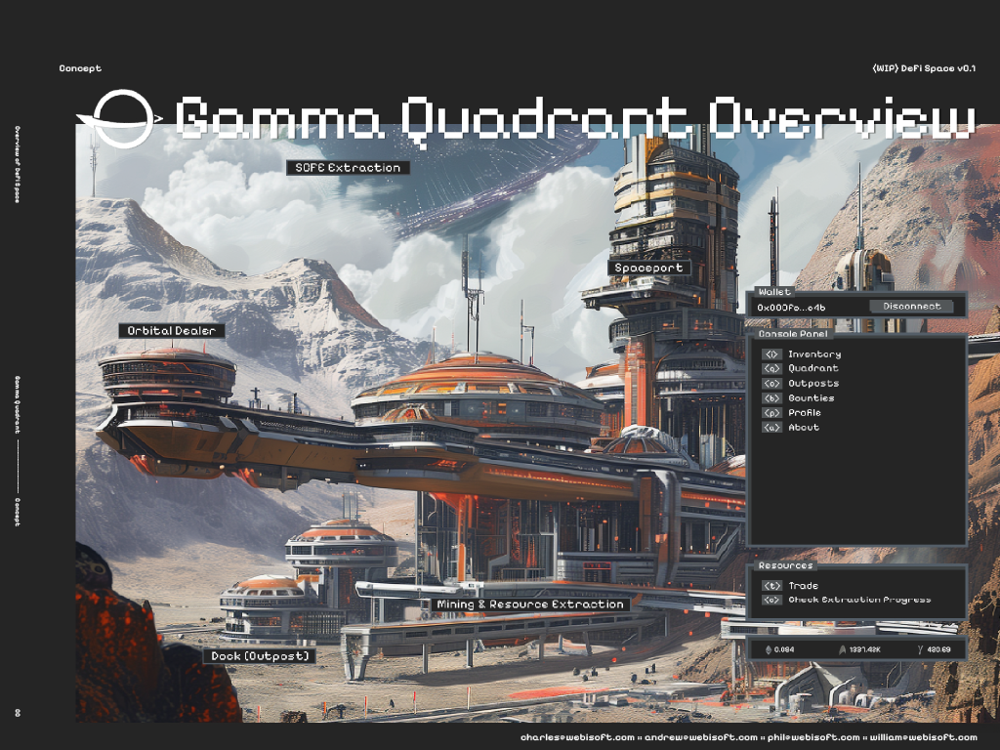
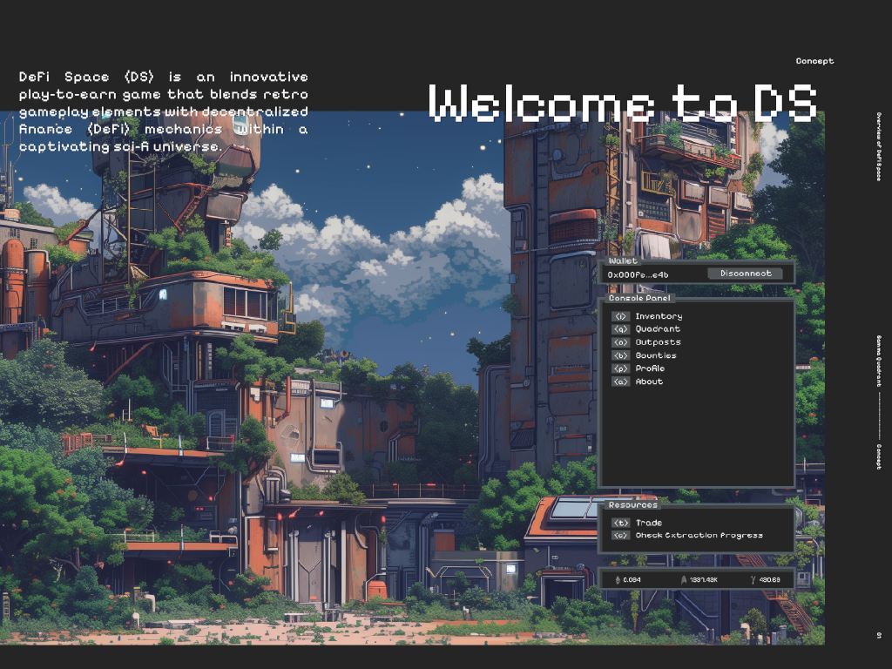
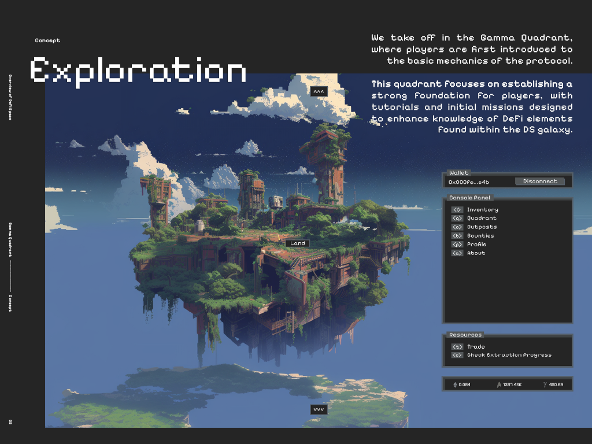
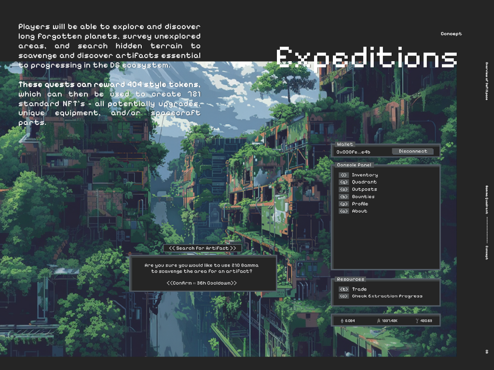
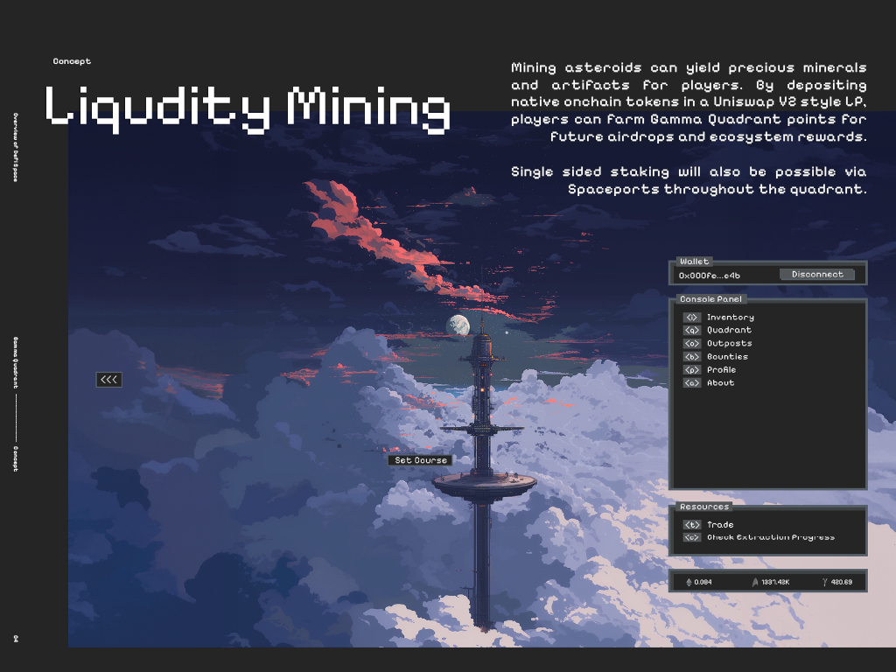
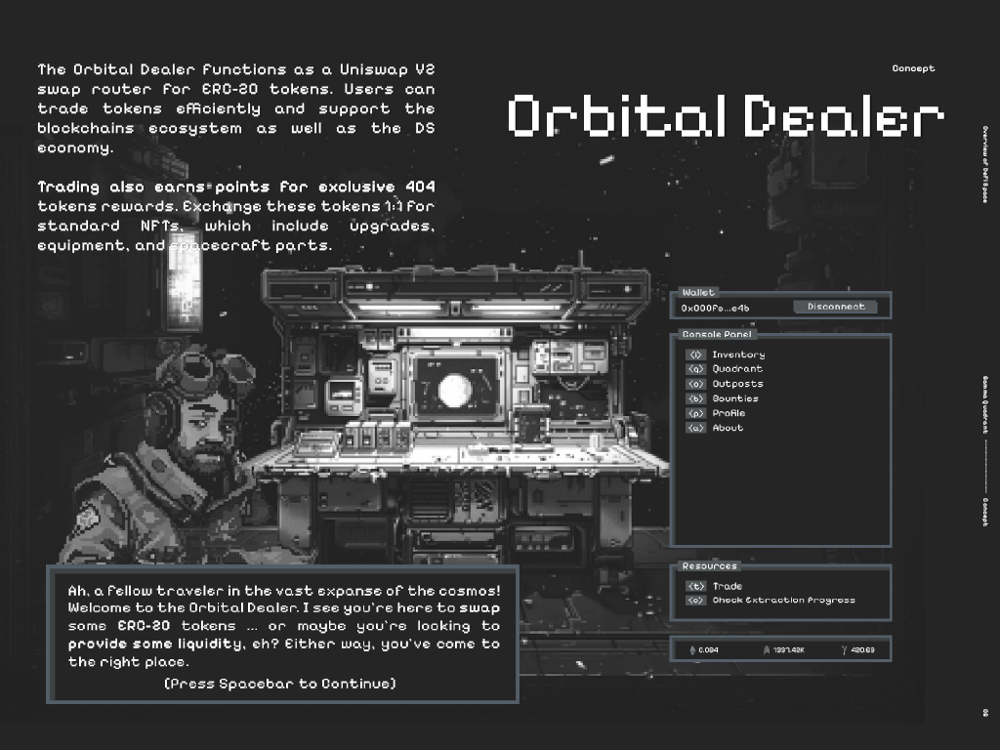
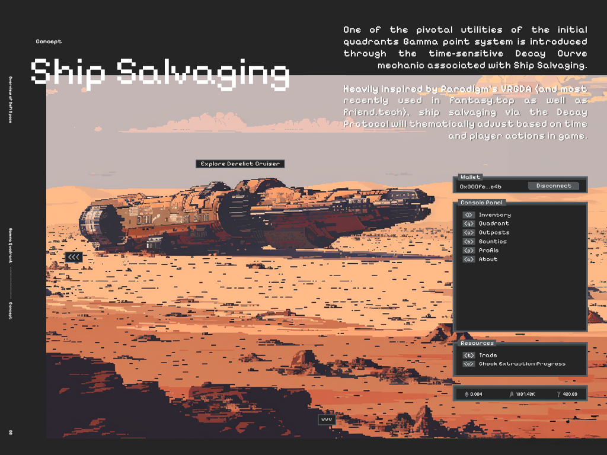

## DS • Gamma Quadrant Overview

DeFi Space (DS) is a cutting-edge blockchain protocol that integrates GameFi elements with decentralized finance (DeFi) mechanics, all set within an engaging sci-fi universe.

The protocol leverages the robust capabilities of Cairo, the programming language behind Starknet, designed for building high-performance, scalable smart contracts.

## 
